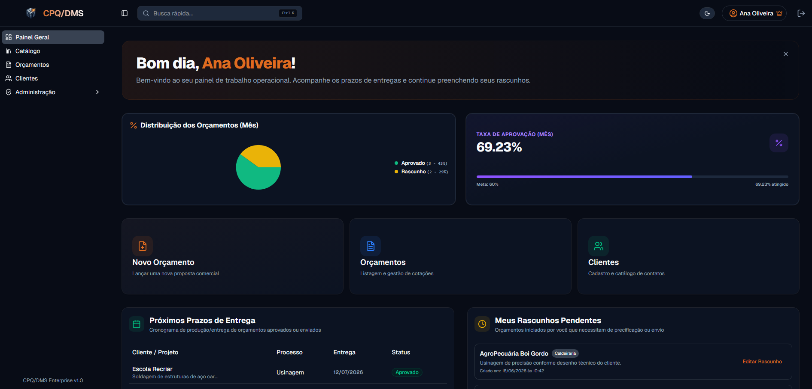
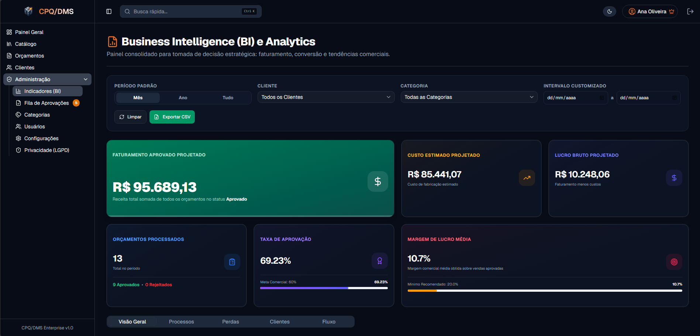
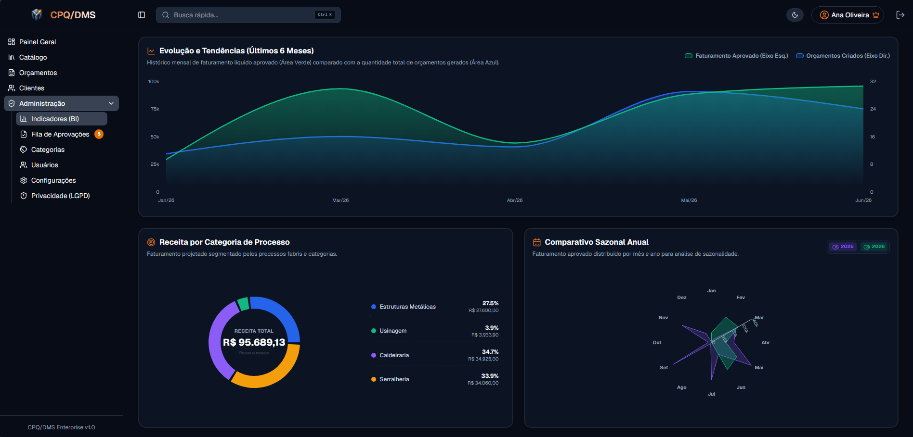
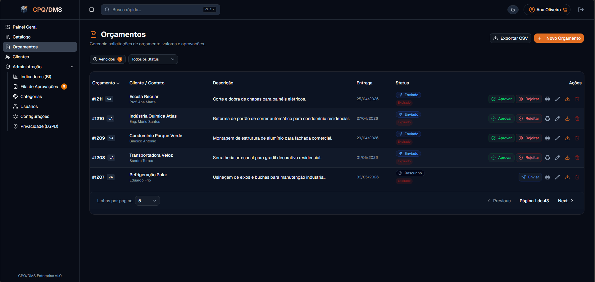
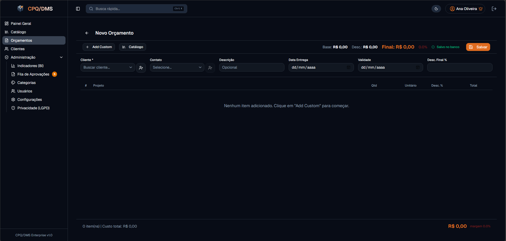
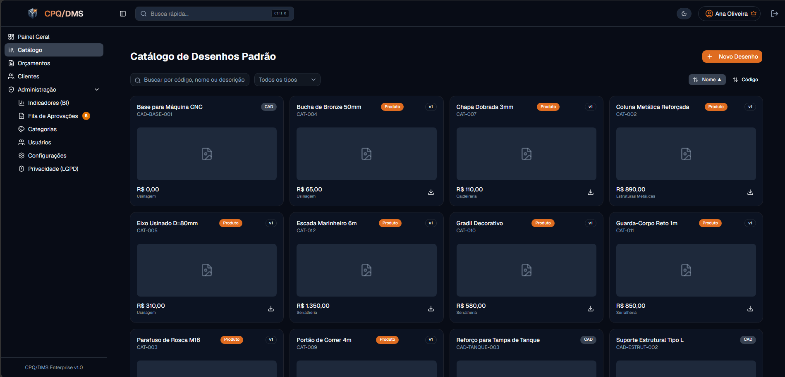
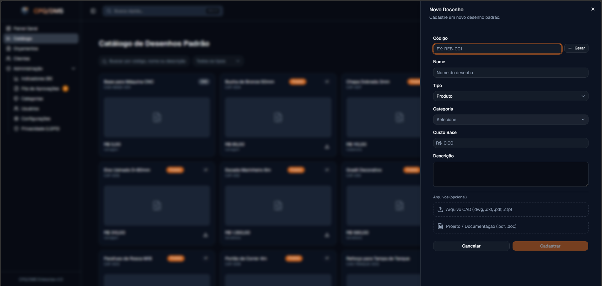
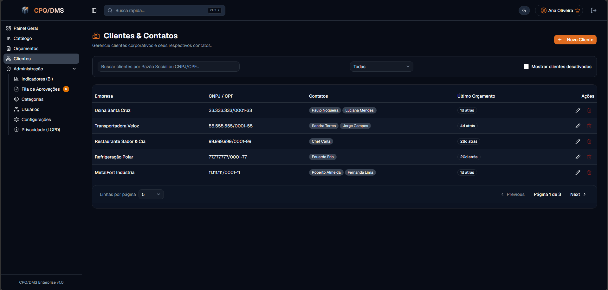
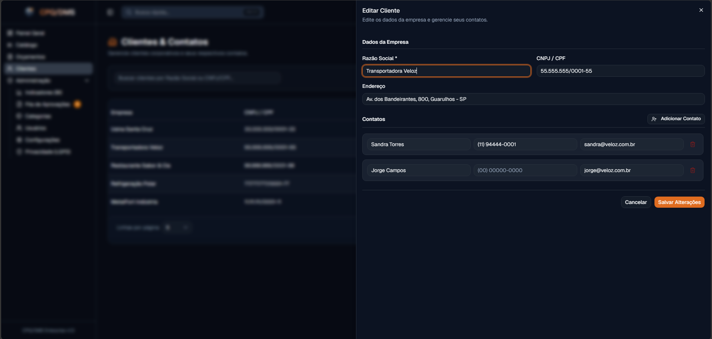

# CPQ/DMS — Sistema de Orçamentos e Catálogo Técnico (Metalúrgica)

<div align="center">

  [](https://github.com/brunofgodoi/metalwork-cpq-dms/actions)
  [](https://react.dev/)
  [](https://www.typescriptlang.org/)
  [](https://tailwindcss.com/)
  [](https://expressjs.com/)
  [](https://www.prisma.io/)
  [](https://www.postgresql.org/)

</div>

---

Sistema interno de **Configure-Price-Quote (CPQ) / Document Management System (DMS)** para indústria metalúrgica de médio e grande porte. Permite que orçamentistas configurem, precifiquem e gerem propostas comerciais para peças metálicas e montagens especiais com um motor de busca por similaridade nativo, BI integrado e rastreabilidade total do ciclo de vida de preços.

## Stack

| Camada       | Tecnologia                                                      |
| ------------ | --------------------------------------------------------------- |
| **Monorepo** | pnpm workspaces                                                 |
| **API**      | Node.js + Express + TypeScript (strict) + Prisma + PostgreSQL   |
| **Frontend** | React 19 + Vite 8 + Tailwind CSS 4 + shadcn/ui                  |
| **Busca**    | Similaridade Jaccard/Dice (nativa, sem vector DB ou IA externa) |
| **Auth**     | JWT + bcryptjs                                                  |
| **Charts**   | Recharts                                                        |

## Estrutura

```
apps/
├── api/      # Express + Prisma (porta 3333)
└── web/      # React + Vite (porta 5173)
```

## Começando

```bash
pnpm install
cd apps/api
npx prisma migrate dev
npx tsx prisma/seed-demo.ts
cd ../..
pnpm dev          # API + Web em paralelo
```

**Login demo:** `ana@metalurgica.com` / `123456` (ADMIN)

## Comandos

| Comando             | O que faz                              |
| ------------------- | -------------------------------------- |
| `pnpm dev`          | API + Web com hot reload               |
| `pnpm api:dev`      | API apenas (porta 3333)                |
| `pnpm web:dev`      | Web apenas (porta 5173)                |
| `pnpm db:seed:demo` | Popula banco com dados de demonstração |
| `pnpm lint`         | ESLint                                 |
| `pnpm format`       | Prettier                               |
| `pnpm api:build`    | Compila API com tsup                   |
| `pnpm web:build`    | Compila Web com Vite                   |

## Funcionalidades Principais

- **Catálogo de desenhos padrão** com filtro tipo (Produto / Auxiliar CAD), ordenação, busca, geração automática de código
- **Orçamentos** com ciclo de vida completo (rascunho → enviado → aprovado/rejeitado), revisões, itens por linha
- **Biblioteca de itens** no compositor de orçamentos com filtro por tipo e badges visuais
- **Busca semântica** por similaridade entre descritivos de orçamentos
- **BI / Analytics** com receita por categoria, taxa de aprovação, tendências mensais, performance por categoria
- **Impressão de proposta** em modal com dados da empresa (logo, rodapé, website)
- **LGPD** — operações de privacidade para clientes, usuários e contatos

## Documentação

A documentação completa do projeto está em [`docs/index.md`](docs/index.md).

## Arquitetura

```
HTTP → authMiddleware → roleMiddleware → validateRequest → Controller → Service → Prisma → PostgreSQL
```

Monorepo com duas partes comunicando via REST. JWT autenticado por Axios interceptor no frontend.
Busca semântica 100% nativa sem dependências externas de IA.

## 📸 Demonstração Visual

Abaixo estão capturas de tela do sistema em funcionamento, divididas pelas áreas principais:

<details>
  <summary>💻 Dashboard & Business Intelligence (Analytics)</summary>
  <br />

  | Dashboard Principal (Home) | Analytics (Visão Geral de Vendas) |
  | :---: | :---: |
  |  |  |

  | Analytics (Performance por Categorias & Clientes) |
  | :---: |
  |  |
</details>

<details>
  <summary>📝 Gestão e Compositor de Orçamentos (Quotes)</summary>
  <br />

  | Listagem de Orçamentos | Compositor de Orçamento (Criação/Edição) |
  | :---: | :---: |
  |  |  |
</details>

<details>
  <summary>⚙️ Catálogo Técnico & Gestão de Clientes (CRM)</summary>
  <br />

  | Catálogo de Desenhos Padrão | Visualização de Detalhes do Item |
  | :---: | :---: |
  |  |  |

  | Listagem de Clientes | Detalhe de Cliente e Contatos |
  | :---: | :---: |
  |  |  |
</details>
