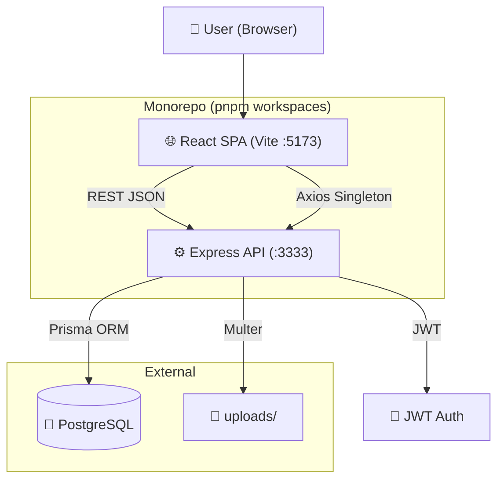
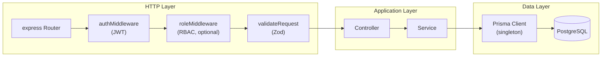
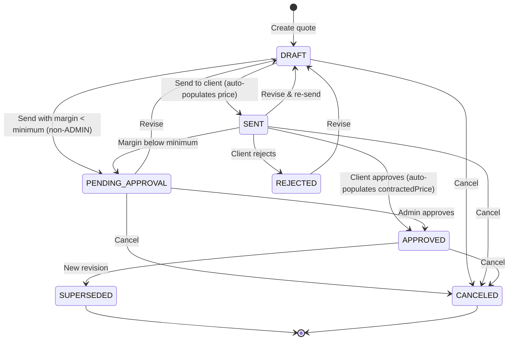
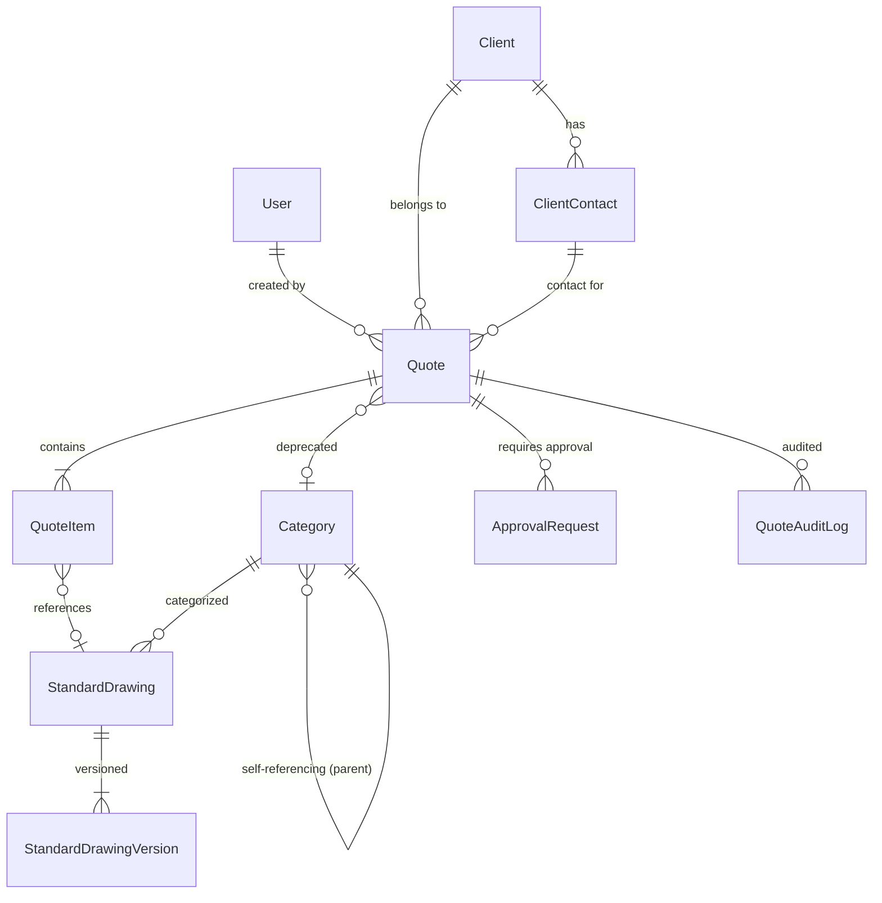
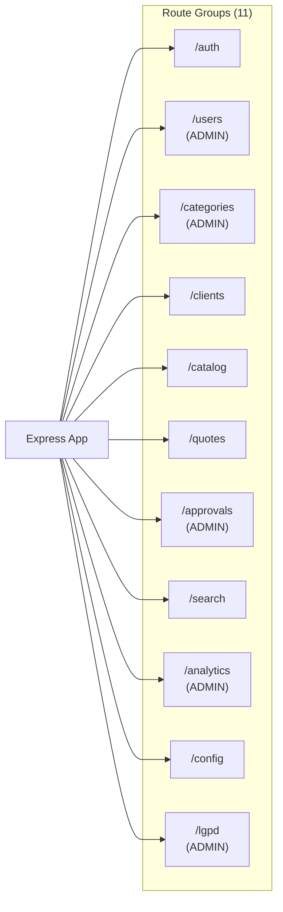
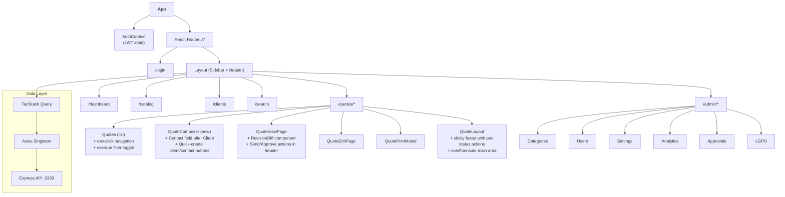

# Architecture Documentation — CPQ/DMS



## API Architecture (`@cpq/api`)

### Layer Structure



```
HTTP Request
  → Route definition (express Router)
  → authMiddleware (JWT verification)
  → roleMiddleware (RBAC, optional)
  → validateRequest (Zod schema)
  → Controller method
  → Service method
  → Prisma Client (singleton)
  → PostgreSQL
  → HTTP Response
```

### Route Groups (11)

| Prefix        | Auth | Admin   | Description                                                          |
| ------------- | ---- | ------- | -------------------------------------------------------------------- |
| `/auth`       | No   | No      | Login, refresh, change password                                      |
| `/users`      | Yes  | Yes     | User CRUD                                                            |
| `/categories` | Yes  | Yes     | Product categories                                                   |
| `/clients`    | Yes  | No      | Client CRM with contacts                                             |
| `/catalog`    | Yes  | No      | Standard drawings (products + CAD helpers + thumbnails)              |
| `/quotes`     | Yes  | No      | Quote lifecycle (CRUD, revisions, items, status)                     |
| `/approvals`  | Yes  | Yes     | Approval workflow                                                    |
| `/search`     | Yes  | No      | Semantic similarity search (Jaccard/Dice + pg_trgm/unaccent indexes) |
| `/analytics`  | Yes  | Admin   | BI dashboards & CSV export                                           |
| `/config`     | Yes  | Partial | System & company configuration                                       |
| `/lgpd`       | Yes  | Yes     | LGPD data privacy                                                    |

### Key Design Decisions

- **Soft delete** via `isActive: Boolean` on all major models
- **Price audit trail**: `estimatedPrice → price → contractedPrice` on quotes — auto-populated
- **Custom PrismaPg adapter** (not native Prisma driver)
- **Global Prisma singleton** to prevent connection exhaustion from tsx hot reload
- **JWT auth** with Axios interceptor for silent 401 → refresh token flow
- **Similarity engine**: native Jaccard/Dice coefficient — no vector DB or external AI
- **Search indexes**: 14 GIN trigram indexes (`pg_trgm` + `unaccent`) accelerate raw SQL ILIKE queries across all searchable text columns, fixing Portuguese accent search (ç, á, é, ã)
- **Auto-revision**: snapshot-based diff — each revision stores a JSON snapshot; `GET /quotes/diff?rev1=X&rev2=Y` compares snapshots
- **Overdue filter**: `?overdue=true` on `GET /quotes` returns quoting with past delivery date in DRAFT/SENT/PENDING_APPROVAL status

### Quote Lifecycle



**Price auto-population:** On DRAFT→SENT, `price` is computed from item totals with discounts. On SENT→APPROVED, `contractedPrice` is set to `quote.price`. Both can be overridden explicitly if sent in the request body.

### Data Model Relationships



---



## Web Architecture (`@cpq/web`)

### Component Tree



```
App
├── AuthContext (JWT state, user, roles)
├── Header
├── Sidebar (navigation + role-based items)
├── Layout (sidebar + content)
└── Routes
    ├── /login (public)
    ├── /dashboard (protected)
    ├── /quotes/* (protected)
    │   ├── / (list with filters, overdue toggle)
    │   ├── /new (QuoteComposer)
    │   ├── /:id (QuoteViewPage + RevisionDiff)
    │   ├── /:id/edit (QuoteComposer in edit mode + auto-revision confirm)
    │   └── /:id/print (QuotePrintModal)
    ├── /catalog (protected)
    ├── /clients (protected)
    ├── /search (protected)
    └── /admin/* (ADMIN only)
```

### State Management

- **Server state**: TanStack React Query 5 (global config in `lib/queryClient.ts`)
- **Auth state**: React Context (`AuthContext.tsx`)
- **Form state**: Local `useState` + `useReducer` (quote draft via `useQuoteDraft.ts`)
- **Persisted state**: `localStorage` for cached branding (logo, system name) — written by `Sidebar`, read by `Login` to render without API call
- **No global client state library** — React Query + Context + localStorage suffice

### UI Component Architecture

- **shadcn/ui** (`radix-nova` style) — generated primitives in `components/ui/`
- **Custom app components** in `components/` (Header, Sidebar, Layout, etc.)
- **Domain-specific components** co-located in `pages/` subdirectories
- **Form components** in `components/forms/` (reusable patterns for create/edit)

### Data Flow

```
User Action
  → Page Component
  → React Query mutation/query
  → Axios singleton (lib/axios.ts)
  → API REST endpoint
  → Prisma → PostgreSQL
  → Response → Query cache invalidation
  → UI re-render
```

### Security

- **RBAC**: 3 roles — `ADMIN`, `ESTIMATOR`, `VIEWER`
- **Protected routes**: `<ProtectedRoute>` wrapper checks auth + role
- **Admin-only routes**: wrapped with `allowedRoles={['ADMIN']}`
- **JWT refresh**: Axios interceptor handles 401 → refresh → retry
