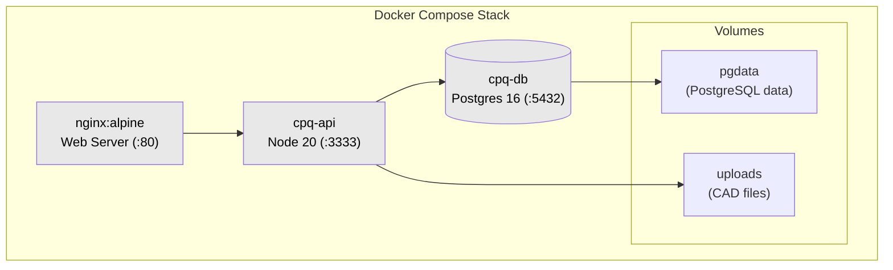

# Deployment Guide — CPQ/DMS

## Architecture



## Services

| Service | Image                              | Port | Purpose                   |
| ------- | ---------------------------------- | ---- | ------------------------- |
| `db`    | `postgres:16-alpine`               | 5432 | PostgreSQL database       |
| `api`   | Build from `./Dockerfile`          | 3333 | Express API (Node 20)     |
| `web`   | Build from `./apps/web/Dockerfile` | 80   | React SPA served by nginx |

## Environment Variables

### API (`cpq-api`)

| Variable       | Description                  | Example                                          |
| -------------- | ---------------------------- | ------------------------------------------------ |
| `DATABASE_URL` | PostgreSQL connection string | `postgresql://user:pass@db:5432/cpq_metalurgica` |
| `PORT`         | API port                     | `3333`                                           |
| `JWT_SECRET`   | Secret key for JWT tokens    | `your-secret`                                    |
| `NODE_ENV`     | Environment mode             | `production`                                     |
| `FRONTEND_URL` | Allowed CORS origin          | `http://localhost:80`                            |

### Web (`cpq-web`)

| Variable       | Description               | Value                          |
| -------------- | ------------------------- | ------------------------------ |
| `VITE_API_URL` | API base URL (build-time) | `/api` (proxied through nginx) |

## Quick Start

### 1. Build and start

```bash
docker compose up -d --build
```

### 2. Run database migrations

```bash
docker compose exec api npx prisma migrate deploy
```

### 3. Seed demo data (optional)

```bash
docker compose exec api node prisma/seed.js
```

### 4. Verify

```bash
curl http://localhost:80          # Web app
curl http://localhost:3333/api    # API health
```

## Volume Management

| Volume    | Mount                           | Purpose                          |
| --------- | ------------------------------- | -------------------------------- |
| `pgdata`  | PostgreSQL data directory       | Persist database across restarts |
| `uploads` | `/app/uploads` in API container | CAD files, thumbnails, documents |

```bash
# Backup database
docker compose exec db pg_dump -U cpq_admin cpq_metalurgica > backup.sql

# Restore database
docker compose exec -T db psql -U cpq_admin cpq_metalurgica < backup.sql

# Backup uploads
docker run --rm -v uploads:/uploads -v $(pwd):/backup alpine tar czf /backup/uploads-backup.tar.gz -C /uploads .
```

## PostgreSQL Extensions

The search engine uses two PostgreSQL extensions for accent-insensitive trigram search:

| Extension  | Purpose                                    |
| ---------- | ------------------------------------------ |
| `pg_trgm`  | Trigram matching for fuzzy text search     |
| `unaccent` | Accent-insensitive comparison (ç, á, é, ã) |

These are installed automatically in two stages:

1. **Migration** `20260522000000_add_search_indexes` runs `CREATE EXTENSION IF NOT EXISTS` for both.
2. **`docker-entrypoint.sh`** also pre-runs the same commands via `npx prisma db execute --stdin` _before_ migrations to ensure extensions exist at the database level.

The migration also creates **14 GIN trigram indexes** on text columns across `clients`, `client_contacts`, `quotes`, `quote_items`, `standard_drawings`, and `categories` — all text-searchable fields are indexed.

> **Managed PostgreSQL (RDS, Cloud SQL, Azure Database):** These providers support both `pg_trgm` and `unaccent`. No additional configuration is needed beyond what the migration provides.

## Production Considerations

### Security

- Change `JWT_SECRET` to a strong random value
- Change `POSTGRES_PASSWORD` in `docker-compose.yml`
- Add TLS termination (reverse proxy like Traefik/Caddy/Nginx)
- Set `NODE_ENV=production` (disables CORS permissive mode)
- Restrict `FRONTEND_URL` to the actual domain

### Scaling

The API runs as a single Node process. For high availability:

- Add a process manager (PM2) or run multiple containers behind a load balancer
- Use a managed PostgreSQL service (RDS, Cloud SQL) for production
- Store uploaded files in object storage (S3, MinIO) instead of local volumes
- Add Redis for session caching if needed

### Monitoring

- API logs via Pino (structured JSON) — forward to your log aggregator
- Health check: `docker compose exec api curl -f http://localhost:3333/api/health`
- Container restart policy: `unless-stopped`

## CI/CD Integration

Example GitHub Actions workflow:

```yaml
name: Deploy

on:
  push:
    branches: [main]

jobs:
  deploy:
    runs-on: ubuntu-latest
    steps:
      - uses: actions/checkout@v4
      - name: Deploy to server
        run: |
          ssh user@host "cd /opt/cpq && git pull && docker compose up -d --build"
```

## Files

| File                   | Purpose                                                                      |
| ---------------------- | ---------------------------------------------------------------------------- |
| `Dockerfile`           | Multi-stage build for API (Node 20, Alpine)                                  |
| `apps/web/Dockerfile`  | Build + nginx serve for web (static SPA)                                     |
| `docker-compose.yml`   | Orchestrate db + api + web services                                          |
| `docker-entrypoint.sh` | API entrypoint (installs pg_extensions, runs migrations, seeds, then starts) |
