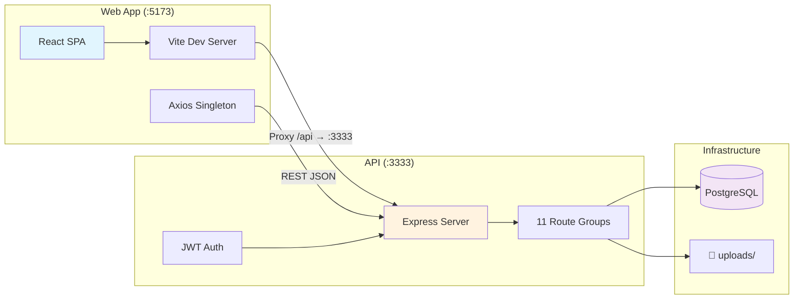
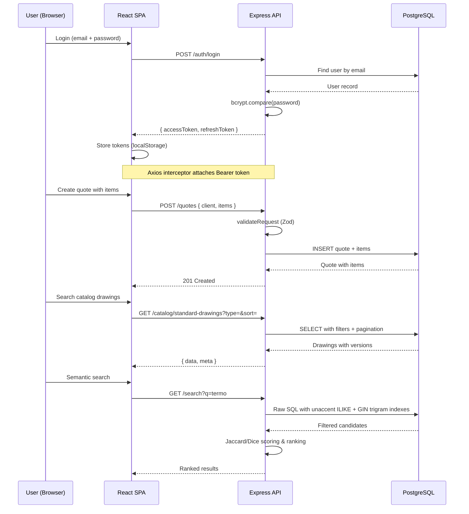

# Integration Architecture — CPQ/DMS

## Overview

Monorepo with 2 parts communicating over HTTP REST.

## Integration Points

| From                  | To            | Type             | Details                             |
| --------------------- | ------------- | ---------------- | ----------------------------------- |
| Web `Axios Singleton` | API `Express` | HTTP REST (JSON) | All data operations                 |
| Web `Vite Dev Server` | API `Express` | HTTP Proxy       | `/api/*` → `localhost:3333/api/*`   |
| API `Routes`          | `PostgreSQL`  | Prisma ORM       | Typed queries via Prisma Client     |
| API `Routes`          | `uploads/`    | File system      | Multer stores CAD/doc files to disk |

## Data Flow

## Shared Dependencies

Both apps share the root `package.json` for:

- **ESLint** — root `.eslintrc.js` + web `eslint.config.js`
- **Prettier** — root `.prettierrc` (single quotes, trailing commas, 100 width)
- **TypeScript** — root `tsconfig.json` (strict, ES2022)

## CORS Configuration

The API allows `FRONTEND_URL` (default `http://localhost:5173`) with credentials.
All API responses include CORS headers matching this single origin.
