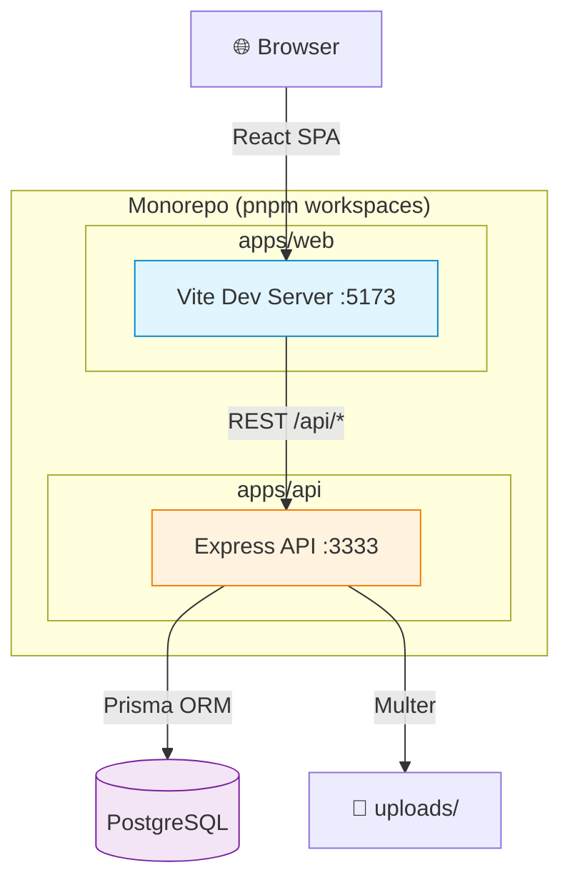
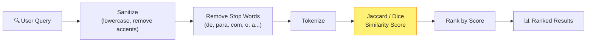

# CPQ/DMS — Project Overview

**Project:** Configure-Price-Quote / Document Management System for Metalworking Factory
**Repository:** Monorepo (pnpm workspaces)
**Date:** 2026-05-22

## Executive Summary

Internal CPQ/DMS catalog system for a metalworking factory. Enables estimators to configure,
price, and quote custom metal parts and assemblies (structural steel, machining, boilermaking,
ironwork) from a catalog of standard drawings, with a semantic similarity search engine
and business intelligence dashboards.

## Parts

| Part | Package    | Path        | Type                       |
| ---- | ---------- | ----------- | -------------------------- |
| API  | `@cpq/api` | `apps/api/` | Backend (Express + Prisma) |
| Web  | `@cpq/web` | `apps/web/` | Frontend (React + Vite)    |

## Tech Stack Summary

| Category     | API (`@cpq/api`)                 | Web (`@cpq/web`)                       |
| ------------ | -------------------------------- | -------------------------------------- |
| Language     | TypeScript 5.9 (strict)          | TypeScript 6.0 (strict)                |
| Runtime      | Node.js (ES2022)                 | Browser (Vite 8)                       |
| Framework    | Express 4.19                     | React 19 + React Router DOM 7          |
| ORM          | Prisma + PrismaPg adapter        | —                                      |
| Database     | PostgreSQL                       | —                                      |
| Validation   | Zod 4                            | —                                      |
| Auth         | JWT + bcryptjs                   | Auth Context (JWT)                     |
| UI           | —                                | shadcn/ui (radix-nova), Tailwind CSS 4 |
| Icons        | —                                | Lucide React                           |
| Charts       | —                                | Recharts                               |
| Server state | —                                | TanStack React Query 5                 |
| HTTP         | Axios                            | Axios (singleton)                      |
| Search       | Jaccard/Dice similarity (native) | —                                      |
| Logging      | Pino + pino-pretty               | —                                      |
| Uploads      | Multer                           | —                                      |
| Theming      | —                                | next-themes                            |
| Toasts       | —                                | Sonner                                 |

## Architecture Type

**Monorepo with 2 parts** — API (backend) and Web (frontend). The API serves a RESTful JSON API
on port 3333. The Web frontend runs on Vite dev server (port 5173) and proxies API requests.
No separate authentication service — JWT tokens are issued and validated by the API itself.

### System Architecture



### Search Engine Flow



## Repository Structure

```
project-root/
├── apps/
│   ├── api/          # Express + Prisma backend
│   └── web/          # React + Vite frontend
├── docs/             # Technical documentation
└── .github/          # GitHub Actions CI/CD workflows
```
